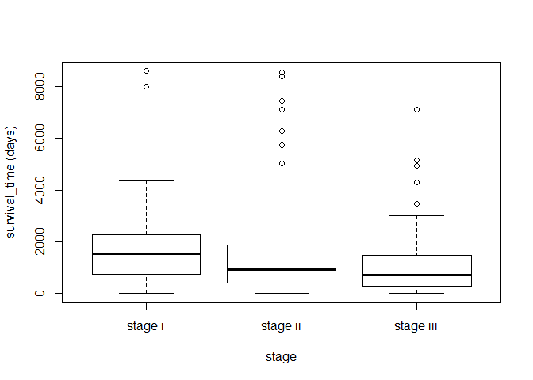

Finding DEGs by ANOVA
================
Soojung Yang
2019 9 25

The goal of this assessment is to perform parametric/nonparametric
statistical testing to see if there are significant difference between
given distributions.

#### **DATASET**

**NCBI Build 37 (UCSC hg19)**  
?€? Citation: Assembly \[Internet\]. Bethesda (MD): National Library of
Medicine (US), National Center for Biotechnology Information; 2012 ?€?
\[cited 2019 09 16\]. Available from:
<https://www.ncbi.nlm.nih.gov/assembly/>

In addition to previously used ?€˜Clinical?€? and ?€˜Mutation?€? datasets,
?€˜Expression?€? dataset was newly analyzed in this assessment.

#### **Expression**

?€? **sample\_id (column)**  
?€? **Hugo\_Symbol (row)**  
?€? For each sample\_id(patient) and Hugo\_Symbol(gene), ?€˜Expression?€?
dataset gives the extent of expression in number. Higher the number,
stronger the expression.

-----

#### **Data Input**

``` r
# BIS335 Data input
clinical<-readRDS("./data/clinical.rds")
expression<-readRDS("./data/expression.rds")
mutation<-readRDS("./data/mutation.rds")

# Common 
# We will remove samples which of subtype is NA (not available).
sample_id_filter<-intersect(colnames(expression),
                            intersect(unique(mutation$sample_id),
                                      clinical$sample_id[which(!is.na(clinical$subtype))]))
clinical_filter<-dplyr::filter(clinical,sample_id %in% sample_id_filter)
mutation_filter<-dplyr::filter(mutation, sample_id %in% sample_id_filter)
expression_filter<-expression[,as.character(clinical_filter$sample_id)]
```

## **Assessment**

For every statistical testing problems, hypothesis, **p values**,
**confidence intervals**, and following conclusion should be noted.
Threshold for p value is
 in
every cases.

> **1. Test whether there is a significant difference in the patient?€™s
> survival time on the stages of breast cancer. For significant changes,
> plot boxplot to visualize difference.**

We should compare the means among 3 samples with single different factor
(stage; stage i, ii, iii). First, we are performing one-way ANOVA
analysis here. Instead of performing t-test for every pairwise
combinations, ANOVA test compares the variability of total sample and
the sum of the variability of each sample. ANOVA tests if there?€™s
**?€˜any?€?** significant difference among several sample groups.
Hypothesis for ANOVA is given as follows.

**Null Hypothesis**: , Alternative hypothesis: 

Then, if the Null hypothesis is rejected, we should compare the samples
pairwise. This can be done by performing Tukey HSD(Honest Significant
Differences). Because of the multiplicity of tests, we should adjust p
values.

**Confidence interval**: 95%, two-sided ()

``` r
# Count the sample population size(n)
stagei_size = length(which(clinical_filter$stage=='stage i'))
stageii_size = length(which(clinical_filter$stage=='stage ii'))
stageiii_size = length(which(clinical_filter$stage=='stage iii'))
print(paste("n_stage i = ", stagei_size, ", n_stage ii = ", stageii_size, ", n_stage iii = ", stageiii_size))
```

    ## [1] "n_stage i =  79 , n_stage ii =  254 , n_stage iii =  86"

``` r
ave_i <- mean(clinical_filter$survival_time[which(clinical_filter$stage=='stage i')])
ave_ii <- mean(clinical_filter$survival_time[which(clinical_filter$stage=='stage ii')])
ave_iii <- mean(clinical_filter$survival_time[which(clinical_filter$stage=='stage iii')])
print(paste("mean survival time for stage i patiens: ", ave_i))
```

    ## [1] "mean survival time for stage i patiens:  1748.50632911392"

``` r
print(paste("mean survival time for stage ii patiens: ", ave_ii))
```

    ## [1] "mean survival time for stage ii patiens:  1292.80708661417"

``` r
print(paste("mean survival time for stage iii patiens: ", ave_iii))
```

    ## [1] "mean survival time for stage iii patiens:  1096.6511627907"

Directly comparing the means of 3 stages, we can see that the mean
survival time is decreasing from stage i to stage iii. Let?€™s see if this
decrease is significant or not.

``` r
anova.result<-aov(survival_time~stage, data=clinical_filter)
summary(anova.result)
```

    ##              Df    Sum Sq Mean Sq F value  Pr(>F)   
    ## stage         2  18840835 9420418    5.08 0.00661 **
    ## Residuals   416 771361725 1854235                   
    ## ---
    ## Signif. codes:  0 '***' 0.001 '**' 0.01 '*' 0.05 '.' 0.1 ' ' 1

We can see that there?€™s a significance difference among stages. Pr(\>F),
which is a probability value for the chance which at least one sample
group is significantly different from others, is large enough to reject
the null hypothesis. Now let?€™s check which pairs are significant. Before
that, in order to observe how p values have adjusted, unadjusted p
values were calculated.

``` r
attach(clinical_filter)
pairwise.t.test(survival_time, stage, p.adj="none")
```

    ## 
    ##  Pairwise comparisons using t tests with pooled SD 
    ## 
    ## data:  survival_time and stage 
    ## 
    ##           stage i stage ii
    ## stage ii  0.0097  -       
    ## stage iii 0.0023  0.2489  
    ## 
    ## P value adjustment method: none

``` r
detach()
```

Here, p values were adjusted by Tukey honestly significant distribution
(HSD) posthoc analysis.

``` r
posthoc <- TukeyHSD(x=anova.result, 'stage', conf.level=0.95)
print(posthoc)
```

    ##   Tukey multiple comparisons of means
    ##     95% family-wise confidence level
    ## 
    ## Fit: aov(formula = survival_time ~ stage, data = clinical_filter)
    ## 
    ## $stage
    ##                         diff        lwr        upr     p adj
    ## stage ii-stage i   -455.6992  -868.3055  -43.09297 0.0262335
    ## stage iii-stage i  -651.8552 -1150.9962 -152.71409 0.0064038
    ## stage iii-stage ii -196.1559  -595.7486  203.43672 0.4810915

We can observe that p values had doubled \~ tripled up after the
adjustment. There is a significant decrease between stage i and stage
ii. P value (0.026) is lower than the threshold. However, from stage ii
to stage iii, there was no significant decrease (p = 0.481). Refer to
following boxplot.

Also, during the p value adjustment, individual confidence level has
changed. to match 0.95 family-wise (simultaneous) confidence level,
individual confidence level has to be 0.95^(1/3) = 0.983 (98.3%).

**individual confidence level**: 0.983  
**simultaneous confidence level**: 0.95

``` r
boxplot(survival_time~stage, data=clinical_filter, xlab='stage', ylab='survival_time (days)', xlim=c(0.5, 3.5))
```

<!-- -->

> **2. Using expression data, derive the differentially expressed genes
> (DEGs) from among stages with different survival time. Make the table
> including number of significant DEGs between each pair of stages.**

In this problem, we will compare if genes were differentially expressed
between stage i and stage ii / stage i and stage iii. First, pairwise t
test will be applied. Then, FDR adjustment for p values will be applied,
since we apply t test subsequently multiple times.

#### **p value and multiple testing problem**

p value is a probability value that the given data could occur given the
null hypothesis. Even though p value is small, smaller than the cut off
(threshold) value, if we subsequently test multiple times, then this
small value can result on large number of false positives. This is
what?€™s called multiple testing problem.

#### **FDR (False Discovery Rate) correction**

FDR corrected p value (=q value) is a probability value where the
significant tests resulting in false positives. In this way, we can sort
out the false positives even from the significant values.

**Null Hypothesis**:  between expression levels of specified
gene G between A stage and B stage, Alternative hypothesis:   
**Confidence interval**: 95%, two-sided ()

``` r
# function for two-sided t test
ttest_pvalue_twosided<-function(x,class,class1,class2,alternative="two.sided"){
  x1<-x[which(class==class1)]
  x2<-x[which(class==class2)]
  ttest.result<-t.test(x=x1, y=x2, alternative=alternative)
  p<-ttest.result$p.value
}
```

#### **datasets**

``` r
# get the expression dataset for each stage 
s1<-as.character(clinical_filter$sample_id[which(clinical_filter$stage=="stage i")])
s2<-as.character(clinical_filter$sample_id[which(clinical_filter$stage=="stage ii")])
s3<-as.character(clinical_filter$sample_id[which(clinical_filter$stage=="stage iii")])

expression.s1<-expression_filter[,s1]
expression.s2<-expression_filter[,s2]
expression.s3<-expression_filter[,s3]
expression.s1_s2<-cbind(expression.s1, expression.s2)
expression.s1_s3<-cbind(expression.s1, expression.s3)
class.s1_s2<-c(rep("stage i",length(s1)), rep("stage ii",length(s2)))
class.s1_s3<-c(rep("stage i",length(s1)), rep("stage iii",length(s3)))
```

#### **stage i and stage ii**

``` r
# apply the t test
compare_i_ii<-apply(X=expression.s1_s2, MARGIN=1, FUN=ttest_pvalue_twosided, class=class.s1_s2, class1="stage i", class2="stage ii", alternative="two.sided")
```

``` r
length(compare_i_ii[which(compare_i_ii<0.05)])
```

    ## [1] 1542

``` r
# FDR adjustment for p values
compare_i_ii.adj<-p.adjust(compare_i_ii,method = "fdr")
```

``` r
# count significant DEGs
length(compare_i_ii.adj[which(compare_i_ii.adj<0.05)])
```

    ## [1] 1

#### **stage i and stage iii**

``` r
# apply the t test
compare_i_iii<-apply(X=expression.s1_s3, MARGIN=1, FUN=ttest_pvalue_twosided, class=class.s1_s3, class1="stage i", class2="stage iii", alternative="two.sided")
```

``` r
length(compare_i_iii[which(compare_i_iii<0.05)])
```

    ## [1] 2042

``` r
# FDR adjustment for p values
compare_i_iii.adj<-p.adjust(compare_i_iii,method = "fdr")
```

``` r
# count significant DEGs
length(compare_i_iii.adj[which(compare_i_iii.adj<0.05)])
```

    ## [1] 19

## **Result analysis**

We have found 1 DEG for stage i and ii, and 19 DEGs for stage i and iii.
Let?€™s see how the FDR adjustment made the result change. Below figure is
a collection of histograms of p values. We can see that (possible) false
positive values are reduced by applying FDR.

``` r
par(mfrow=c(2,2))
hist(compare_i_ii)
hist(compare_i_ii.adj)
hist(compare_i_iii)
hist(compare_i_iii.adj)
```

<!-- -->

**Table including number of DEGs for every significant pairs**

``` r
a <- names(which(compare_i_ii.adj<0.05))
b <- names(which(compare_i_iii.adj<0.05))
table. <- data.frame("Comparison set" = c("i - ii", "i - iii"), "number of DEGs" = c(1, 19), "DEG list" = I(list(a, b)))
table.
```

    ##   Comparison.set number.of.DEGs     DEG.list
    ## 1         i - ii              1      ZC3H12D
    ## 2        i - iii             19 MIER1, P....

Let?€™s check if DEG of stage i-ii **ZC3H12D** is also a DEG of stage
i-iii.

``` r
print ("ZC3H12D" %in% b)
```

    ## [1] TRUE

DEG of stage i - ii **ZC3H12D** is again a DEG of stage i - iii. This
might imply that this gene plays an important role throughout every
stages of cancer.

> **3. Test whether there is a significant difference in the patients?€?
> survival time between different subtypes. Compare ?€˜Luminal A?€?,
> ?€˜Luminal B?€?, ?€˜HER2-enriched?€?, and ?€˜Basal-like?€? (total 4) subtypes.
> Plot boxplot to visualize their difference.**

We will analyze with sampe procedure as in problem 1.

**Null Hypothesis**: ,
Alternative hypothesis: 

**Confidence interval**: 95%, two-sided ()

#### **Datasets**

``` r
# Remove "Normal-like" subtypes
sample_id_filter2 <- clinical_filter$sample_id[which(clinical_filter$subtype!="Normal-like")]
clinical_filter2 <- dplyr::filter(clinical_filter, sample_id %in% sample_id_filter2)
```

Now, we perform ANOVA & TukeyHSD analysis on the dataset.

``` r
anova.result2<-aov(survival_time~subtype, data=clinical_filter2)
posthoc2 <- TukeyHSD(x=anova.result2, 'subtype', conf.level=0.95)
summary(anova.result2)
```

    ##              Df    Sum Sq Mean Sq F value Pr(>F)
    ## subtype       3   7341108 2447036   1.295  0.276
    ## Residuals   409 772762587 1889395

Since Pr(\>F) is larger than 0.05, we can confirm the null hypothesis.

``` r
posthoc2
```

    ##   Tukey multiple comparisons of means
    ##     95% family-wise confidence level
    ## 
    ## Fit: aov(formula = survival_time ~ subtype, data = clinical_filter2)
    ## 
    ## $subtype
    ##                                diff        lwr      upr     p adj
    ## HER2-enriched-Basal-like -375.34522 -1042.3523 291.6619 0.4679226
    ## Luminal A-Basal-like       23.54768  -450.7701 497.8655 0.9992489
    ## Luminal B-Basal-like     -179.26442  -714.1940 355.6652 0.8231646
    ## Luminal A-HER2-enriched   398.89291  -194.0443 991.8301 0.3066515
    ## Luminal B-HER2-enriched   196.08081  -446.3729 838.5345 0.8602091
    ## Luminal B-Luminal A      -202.81210  -641.9314 236.3072 0.6326181

Post hoc Tukey HSD analysis also shows the same result. Adjusted p
values are not small enough to reject the null hypothesis. Survival time
doesn?€™t depend on subtypes.

During the p value adjustment, individual confidence level has changed.
to match 0.95 family-wise (simultaneous) confidence level, individual
confidence level has to be 0.95^(1/4) = 0.987 (98.7%).

**individual confidence level**: 0.987  
**simultaneous confidence level**: 0.95

``` r
boxplot(survival_time~subtype, data=clinical_filter2, xlab='subtype', ylab='survival_time', xlim=c(0.5, 4.5))
```

<!-- -->

Boxplot also shows that there are no significant difference between
subtypes.

``` r
survival_lumA <- clinical_filter$survival_time[which(clinical_filter$subtype=="Luminal A")]
survival_lumB <- clinical_filter$survival_time[which(clinical_filter$subtype=="Luminal B")]
survival_HER <- clinical_filter$survival_time[which(clinical_filter$subtype=="HER2-enriched")]
survival_Basal <- clinical_filter$survival_time[which(clinical_filter$subtype=="Basal-like")]
df_ave <- data.frame("subtype" = c("Luminal A", "Luminal B", "HER2-enriched", "Basal-like"), "mean survival time" = c(mean(survival_lumA), mean(survival_lumB), mean(survival_HER), mean(survival_Basal)))
df_ave
```

    ##         subtype mean.survival.time
    ## 1     Luminal A           1436.257
    ## 2     Luminal B           1233.444
    ## 3 HER2-enriched           1037.364
    ## 4    Basal-like           1412.709

## **Discussion**

**(1) Survival time on stage **  
There was a significant decrease of survival time between stage i - ii,
and stage i - iii. Since stage iii patients passed stage ii, we can say
that the survival time drops between stage i and ii, but somewhat stays
similar between stage ii and iii. This result shows that the early
diagnose of cancer is important.

**(2) Differentially Expressed Genes **  
There was one DEG between stage i and ii. This gene was also a DEG for
stage i - iii. This gene might play an important role throughout the
whole stages of cancer. Between stage i - iii, there were 18 other DEGs.

**(3) Survival time on subtypes **  
There was no significant difference of survival time among subtypes.
However, reference \[2\] tells us that there **exists** difference of
survival time among subtypes. Reference \[2\] studied four subtypes;
Luminal A, Luminal B, HER2-enriched, Basal-like, as in this assessment.
The reason why the results are different is that the patient data
analyzed here is biased on relatively short survival time.


Figure above shows us that there?€™s almost no difference among subtypes
when the analysis time is less than \~40 months. As shown in the
boxplot, our data is biased around 0\~2000 days (=60 months). This might
be a reason why there was no significant difference shown in our data.

## References

  - \[1\] Tutorial Manual (KAIST BiS335)  
  - \[2\] Expression of Breast Cancer Subtypes Based on the Most
    Important Biomarkers: Comparison of Clinicopathological Factors and
    Survival, Mohammad Hadeizadeh et al., Iranian Red Crescent Medical
    Journal: 20 (1); e57931, DOI : 10.5812/ircmj.57931
