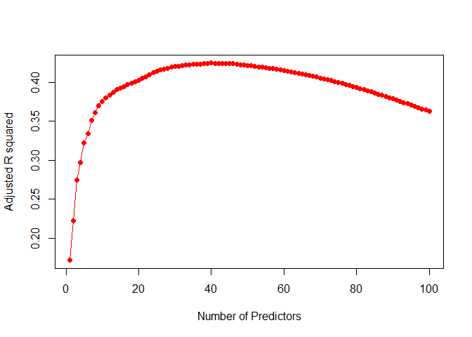
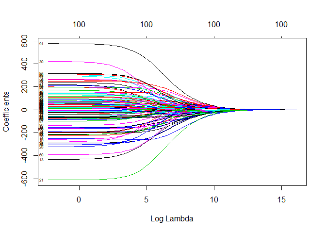
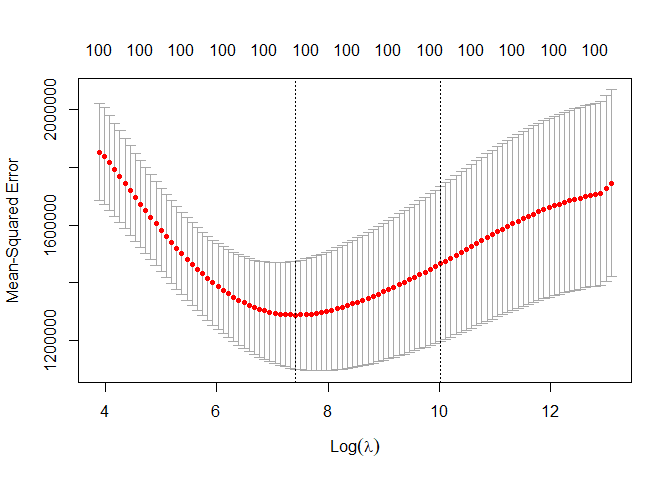
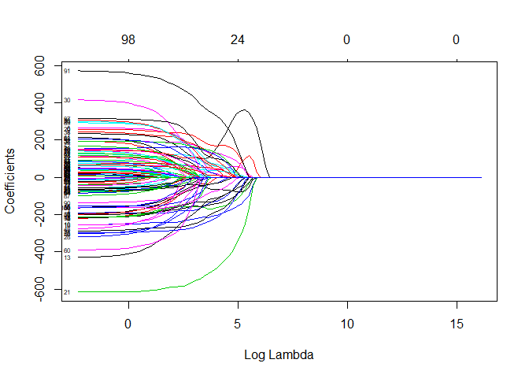
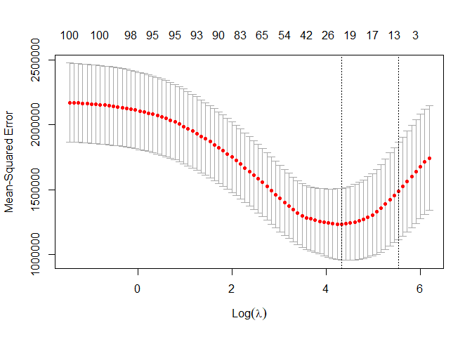

Forward feature selection with Ridge and Lasso regularization
================
Soojung Yang
2019 11 25

The goal of this assessment is to understand feature selection methods
for regression model, and implement subset seletion process through
forward stepwise feature selection. Also, we implement regularization
(weight shrinkage) methods Ridge and Lasso.

``` r
# Load libraries
library(dplyr)
```

    ## 
    ## Attaching package: 'dplyr'

    ## The following objects are masked from 'package:stats':
    ## 
    ##     filter, lag

    ## The following objects are masked from 'package:base':
    ## 
    ##     intersect, setdiff, setequal, union

``` r
library(data.table)
```

    ## 
    ## Attaching package: 'data.table'

    ## The following objects are masked from 'package:dplyr':
    ## 
    ##     between, first, last

``` r
library(MASS)
```

    ## 
    ## Attaching package: 'MASS'

    ## The following object is masked from 'package:dplyr':
    ## 
    ##     select

``` r
library(leaps)
library(glmnet)
```

    ## Loading required package: Matrix

    ## Loaded glmnet 3.0-1

``` r
library(preprocessCore)
```

#### **DATASET**

**NCBI\_Build 37 (UCSC hg19)**

-----

#### **Data Input**

``` r
# Load and preprocess data
clin <- readRDS("./clinical.rds")
gex <- readRDS("./expression.rds")
# Clinical data preprocessing
clin <- clin[clin$survival_time!= 0, ] # remove survival_time is zero
idx <- intersect(colnames(gex), clin$sample)
clin_p <- clin[clin$sample_id %in% idx, ]
surv_time <- clin_p$survival_time
# Gene expression data preprocessing
gex_p <- gex[, colnames(gex) %in% idx]
gex_p <- na.omit(gex_p) # Remove genes containing NA
temp <- normalize.quantiles(gex_p) # Quantile Normalize
colnames(temp) <- colnames(gex_p)
rownames(temp) <- rownames(gex_p)
gex_p <- temp
# Gene selection for decreasing computation time using correlation
cor.p <- cor.coef <- cor.idx <- c()
for(i in 1:dim(gex_p)[1]){
cor.p <- c(cor.p, cor.test(clin_p$survival_time, gex_p[i, ], method="pearson")$p.value)
cor.coef <- c(cor.coef, cor.test(clin_p$survival_time, gex_p[i, ], method="pearson")$estimate)
}
cor.idx <- order(cor.p, decreasing=FALSE)[1:100] # (Correlation P value top n genes)
gex_p.cor <- t(gex_p[cor.idx, ])
data.cor <- data.frame(surv_time, gex_p.cor)
```

``` r
regfit <- regsubsets(surv_time ~ ., data = data.cor, method="forward", nvmax = 100)
reg.sum <- summary(regfit)
```

We can plot the number of predictors versus adjusted R squared value
graph. There exists clear optimal value for number of predictors, which
maximizes the adjusted R squared value.

``` r
plot(reg.sum$adjr2, type = 'l', col = "red",
xlab = "Number of Predictors", ylab = "Adjusted R squared")
points(reg.sum$adjr2, col = "red", pch = 16)
```

<!-- -->

The optimal value for number of predictors is 40.

``` r
opt.pred <- which.max(reg.sum$adjr2)
adjr <- reg.sum$adjr2[opt.pred]
print(opt.pred)
```

    ## [1] 40

``` r
print(adjr)
```

    ## [1] 0.4247232

## Ridge and Lasso regularization (weight shrinkage)

## Ridge

“glmnet” package performs regression on (x, y) while performing grid
search for lambda. If alpha equals to 0, the regularization is ‘Ridge’.
If alpha equals to 1, the regularization is ‘Lasso’. Any value between 0
and 1 is for the elastic-net penalty, where Ridge and Lasso penalty are
combined at once.

The values below shows all lambda values for grid search.

``` r
x <- gex_p.cor
y <- surv_time
## Ridge Regression
grid <- 10^seq(7, -1, length = 100) # To find optimal lambda
ridge <- glmnet(x, y, alpha = 0, lambda = grid, standardize = TRUE) # ridge regression
ridge$lambda # display all lambda values
```

    ##   [1] 1.000000e+07 8.302176e+06 6.892612e+06 5.722368e+06 4.750810e+06
    ##   [6] 3.944206e+06 3.274549e+06 2.718588e+06 2.257020e+06 1.873817e+06
    ##  [11] 1.555676e+06 1.291550e+06 1.072267e+06 8.902151e+05 7.390722e+05
    ##  [16] 6.135907e+05 5.094138e+05 4.229243e+05 3.511192e+05 2.915053e+05
    ##  [21] 2.420128e+05 2.009233e+05 1.668101e+05 1.384886e+05 1.149757e+05
    ##  [26] 9.545485e+04 7.924829e+04 6.579332e+04 5.462277e+04 4.534879e+04
    ##  [31] 3.764936e+04 3.125716e+04 2.595024e+04 2.154435e+04 1.788650e+04
    ##  [36] 1.484968e+04 1.232847e+04 1.023531e+04 8.497534e+03 7.054802e+03
    ##  [41] 5.857021e+03 4.862602e+03 4.037017e+03 3.351603e+03 2.782559e+03
    ##  [46] 2.310130e+03 1.917910e+03 1.592283e+03 1.321941e+03 1.097499e+03
    ##  [51] 9.111628e+02 7.564633e+02 6.280291e+02 5.214008e+02 4.328761e+02
    ##  [56] 3.593814e+02 2.983647e+02 2.477076e+02 2.056512e+02 1.707353e+02
    ##  [61] 1.417474e+02 1.176812e+02 9.770100e+01 8.111308e+01 6.734151e+01
    ##  [66] 5.590810e+01 4.641589e+01 3.853529e+01 3.199267e+01 2.656088e+01
    ##  [71] 2.205131e+01 1.830738e+01 1.519911e+01 1.261857e+01 1.047616e+01
    ##  [76] 8.697490e+00 7.220809e+00 5.994843e+00 4.977024e+00 4.132012e+00
    ##  [81] 3.430469e+00 2.848036e+00 2.364489e+00 1.963041e+00 1.629751e+00
    ##  [86] 1.353048e+00 1.123324e+00 9.326033e-01 7.742637e-01 6.428073e-01
    ##  [91] 5.336699e-01 4.430621e-01 3.678380e-01 3.053856e-01 2.535364e-01
    ##  [96] 2.104904e-01 1.747528e-01 1.450829e-01 1.204504e-01 1.000000e-01

Now, we plot all the coefficients after performing Ridge regresion.
Here, each curve corresponds to a variable. The x-axis varies by the
size of lambda. We can see that larger the lambda, lower the variance of
the coefficents. Large lambda can be seen as high bias. Thus, this
phenomenon can be thought as bias-variance tradeoff example.

``` r
plot(ridge, xvar = "lambda", label = TRUE)
```

<!-- -->

The graph below shows us that there are optimal lambda value. While
regularization makes train loss worse, it might lower the test loss by
generalizing the model. We calculated test MSE while varying the lambda
value. The test MSE was obtained by 10-fold cross validation.

``` r
set.seed(1)
train <- sample(1:nrow(x), nrow(x)/2) # Development:Test=0.5:0.5
test <- (-train)
y.test <- y[test]
ridge.mod <- glmnet(x[train,], y[train], alpha=0, lambda = grid)
cv.ridge <- cv.glmnet(x[train, ], y[train], alpha=0, nfolds=10)
plot(cv.ridge)
```

<!-- -->

The optimal lambda is shown as below:  
In tutorial , lambda.1se had been used. This value is the most
regularized case while keeping the MSE within one standard error from
the minimum MSE. However, I used lambda.min to get the lambda with the
minimum MSE.

``` r
bestlambda <- cv.ridge$lambda.min
bestlambda
```

    ## [1] 1667.25

The test set MSE is shown below, before applying Ridge and after
applying Ridge. Optimal value of lambda was used for Ridge. MSE had
reduced a lot after applying Ridge.

``` r
ridge.pred <- predict(ridge.mod, s = bestlambda, newx = x[test,])
# test set MSE
print(mean((mean(y[train]) - y.test)^2)) # When simply fit a model with an intercept
```

    ## [1] 1970488

``` r
print(mean((ridge.pred - y.test)^2)) # When Ridge is applied
```

    ## [1] 1368742

Below is the predicted coefficients as a result of regression.

``` r
out <- glmnet(x, y, alpha = 0, lambda = grid)
predict(out, type = "coefficients", s = bestlambda)
```

    ## 101 x 1 sparse Matrix of class "dgCMatrix"
    ##                        1
    ## (Intercept) 3130.0785041
    ## FABP1         62.7209537
    ## TDGF1         48.7604396
    ## OR1D2          9.7844608
    ## G6PC         -90.9077773
    ## IAPP         -32.4327129
    ## CLK1          42.2646026
    ## KIRREL       -79.6687965
    ## COX7A1       -58.2570948
    ## ANKS4B        35.7234039
    ## MEFV        -172.7550590
    ## LIMK1          5.5694317
    ## PAPOLA       -29.7081660
    ## TGFBRAP1     -90.3873911
    ## NKAPL         -1.7496424
    ## TLR2         -81.1062138
    ## DNTT         -84.4321549
    ## GCKR          76.2741765
    ## GAST         -39.0336001
    ## CD14         -36.1121196
    ## GYPB          97.1042492
    ## SERPIND1    -208.0084120
    ## KLRC4          1.2778381
    ## SHBG          97.5150463
    ## SET            4.0321032
    ## PRKCI         -9.2862826
    ## AMHR2         54.5531979
    ## RSPO2        -13.9990181
    ## TNFSF9       -16.1097233
    ## LMNB1         12.6446278
    ## FAM131C        9.0789300
    ## LHFPL2      -121.3728383
    ## SLC39A5       63.7092562
    ## MFHAS1         2.2891302
    ## LOC440348     14.1099606
    ## SERPINF2      10.9822630
    ## KIAA1394     123.0918936
    ## THOC5        -95.4010416
    ## TYROBP       136.5838666
    ## REST          -7.6175153
    ## VIL1          82.9726222
    ## CSAD          26.5008866
    ## ALDH18A1      -5.2853100
    ## FLJ25404    -105.4867794
    ## JMJD2A        12.0126510
    ## HGFAC        -45.6903536
    ## STX6           7.8433042
    ## KIAA1505      37.1088785
    ## GIPR         -45.9918921
    ## C10orf96     -28.1944485
    ## PRAMEF8       92.2760606
    ## MAL           81.4470323
    ## CGB2          36.0518341
    ## APP          -20.9630985
    ## LGALS4        41.6784050
    ## C1orf142     -51.2683380
    ## ASGR1          1.5992175
    ## MST1          19.0166702
    ## LCAT         -25.2359660
    ## AHSG          37.7532476
    ## F2           -55.6042134
    ## CKAP2L        16.9462684
    ## TTR           14.5293969
    ## SSR1         -27.3600483
    ## SLC26A10      -0.4246189
    ## IL17RA       -36.0212974
    ## C14orf162    -66.9695649
    ## CKAP4         -9.1850075
    ## CTCFL        -10.3326523
    ## STAB1          5.6589439
    ## HBG1         -13.2090346
    ## CALCOCO1      -0.1915456
    ## HIRA          35.1968844
    ## IFRG15       -37.3407848
    ## FAM111B       10.2646834
    ## NHN1          14.1002373
    ## TMPRSS11F   -115.1391997
    ## OR5J2         19.3607255
    ## SIGLEC10     -22.6672993
    ## ATF6         -55.0159414
    ## NLGN2         95.8332346
    ## DPPA4        -61.7677687
    ## CCDC66        17.6261011
    ## LIN28B        -7.0626563
    ## SPATA13       -0.9854093
    ## RPL11         -2.4340133
    ## TRIM59        -6.5270938
    ## LRRIQ2        -7.0485001
    ## ITIH3         45.7072572
    ## DDX6          36.8761567
    ## LOC440248    -14.8859250
    ## PMS2CL       180.5621602
    ## P2RY4          8.9104009
    ## FCGR3A         1.4670454
    ## RAG2         -37.4952938
    ## RSPO3          7.7762226
    ## ZNF509        46.6568339
    ## CAV3          62.8850877
    ## ANXA6         31.6046181
    ## SLC15A3       -6.9356195
    ## LARP7        -14.7450279

## Lasso

``` r
lasso <- glmnet(x, y, alpha = 1, lambda = grid, standardize = TRUE) # lasso regression
coef(lasso)[1:5, 1:5]
```

    ## 5 x 5 sparse Matrix of class "dgCMatrix"
    ##                   s0       s1       s2       s3       s4
    ## (Intercept) 1439.618 1439.618 1439.618 1439.618 1439.618
    ## FABP1          .        .        .        .        .    
    ## TDGF1          .        .        .        .        .    
    ## OR1D2          .        .        .        .        .    
    ## G6PC           .        .        .        .        .

Compared to Ridge, Lasso makes small coefficients easily go to zeros,
and large coefficients go even larger. This is shown in the plot below.

``` r
plot(lasso, xvar = "lambda", label = TRUE)
```

<!-- -->

Again, there exits an optimal value for lambda, where Lasso minimizes
the test MSE.

``` r
lasso.mod <- glmnet(x[train,], y[train], alpha=1, lambda = grid)
cv.lasso <- cv.glmnet(x[train, ], y[train], alpha=1, nfolds=10)
plot(cv.lasso)
```

<!-- -->

Obtained optimal lambda value is much smaller than in Ridge.

``` r
bestlambda <- cv.lasso$lambda.min
bestlambda
```

    ## [1] 75.60775

The model performance was enhanced after applying Lasso regularization,
but still Ridge was better.

``` r
lasso.pred <- predict(lasso.mod, s = bestlambda, newx = x[test,])
print(mean((mean(y[train]) - y.test)^2))
```

    ## [1] 1970488

``` r
print(mean((lasso.pred - y.test)^2))
```

    ## [1] 1424749

As we print out the coefficients here, we can clearly see that the
increase of the sparsity. Small coefficients reduced to zeros, and large
coefficients became even larger.

``` r
# Lasso model
out <- glmnet(x, y, alpha = 1, lambda = grid)
predict(out, type = "coefficients", s = bestlambda)
```

    ## 101 x 1 sparse Matrix of class "dgCMatrix"
    ##                       1
    ## (Intercept) 3448.960754
    ## FABP1        214.436680
    ## TDGF1          .       
    ## OR1D2          .       
    ## G6PC        -111.420074
    ## IAPP           .       
    ## CLK1          49.293108
    ## KIRREL       -67.442320
    ## COX7A1         .       
    ## ANKS4B         .       
    ## MEFV        -190.772180
    ## LIMK1          .       
    ## PAPOLA         .       
    ## TGFBRAP1     -98.948097
    ## NKAPL          .       
    ## TLR2        -154.235400
    ## DNTT         -14.990747
    ## GCKR          52.187530
    ## GAST           .       
    ## CD14           .       
    ## GYPB         170.573663
    ## SERPIND1    -454.412639
    ## KLRC4          .       
    ## SHBG          60.229439
    ## SET            .       
    ## PRKCI          .       
    ## AMHR2         35.804948
    ## RSPO2          .       
    ## TNFSF9         .       
    ## LMNB1          .       
    ## FAM131C        .       
    ## LHFPL2      -166.259135
    ## SLC39A5        .       
    ## MFHAS1         .       
    ## LOC440348      .       
    ## SERPINF2       .       
    ## KIAA1394     120.650530
    ## THOC5        -99.458002
    ## TYROBP        66.206705
    ## REST           .       
    ## VIL1          96.162816
    ## CSAD           .       
    ## ALDH18A1       .       
    ## FLJ25404    -131.908952
    ## JMJD2A         .       
    ## HGFAC          .       
    ## STX6           .       
    ## KIAA1505      33.100841
    ## GIPR           .       
    ## C10orf96       .       
    ## PRAMEF8        9.557881
    ## MAL          107.681526
    ## CGB2           .       
    ## APP            .       
    ## LGALS4         .       
    ## C1orf142       .       
    ## ASGR1          .       
    ## MST1           .       
    ## LCAT           .       
    ## AHSG           .       
    ## F2             .       
    ## CKAP2L         .       
    ## TTR            .       
    ## SSR1           .       
    ## SLC26A10       .       
    ## IL17RA         .       
    ## C14orf162    -58.217574
    ## CKAP4          .       
    ## CTCFL          .       
    ## STAB1          .       
    ## HBG1           .       
    ## CALCOCO1       .       
    ## HIRA           5.000980
    ## IFRG15         .       
    ## FAM111B        .       
    ## NHN1           .       
    ## TMPRSS11F   -189.396854
    ## OR5J2          .       
    ## SIGLEC10       .       
    ## ATF6         -21.066452
    ## NLGN2         40.525378
    ## DPPA4          .       
    ## CCDC66         .       
    ## LIN28B         .       
    ## SPATA13        .       
    ## RPL11          .       
    ## TRIM59         .       
    ## LRRIQ2         .       
    ## ITIH3          1.103147
    ## DDX6           .       
    ## LOC440248      .       
    ## PMS2CL       296.655390
    ## P2RY4          .       
    ## FCGR3A         .       
    ## RAG2           .       
    ## RSPO3          .       
    ## ZNF509         .       
    ## CAV3          91.586139
    ## ANXA6          7.095552
    ## SLC15A3        .       
    ## LARP7          .

## **Problems**

> **1. Find optimal number of predictors which minimize adjusted r
> square using forward stepwise feature selection. **

The optimal value for number of predictors is 40. Refer to the R
sessions above.

> **2. Compare Ridge Regression & Lasso model. Which one is better?
> Discuss its reason in terms of lambda (Regularization intensity) **

Lasso (L1) regularization and Ridge (L2) regularization both regularize
(or generalize) the model by reducing the weights. Both methods prevent
the model from overfitting to the train dataset. Regularization
intensity, lambda, is a hyperparameter that controls the tradeoff
bewtween low train loss (when lambda is small) and small weights (when
lambda is large). Larger the lambda, smaller the weights becomes.

The difference bewteen Lasso and Ridge is that Lasso increases sparsity
of the weights. By increased sparsity, it means that small weights
easily go to zeros. Instead, large weights would increase in steeper
slope compared to Ridge. Thus, Lasso model is beneficial when the
predictors are sparse. When only few predictors really matters, we want
the weights to be sparse. Since Lasso increases the sparsity, the
regression would be more efficient. On the other hand, Ridge can be used
when most of the predictors are effective.

Usually for medical data, Lasso is more effective, because the
predictors are highly sparse. In the case of our assessment, however,
Ridge was more effective on reducing test MSE. Optimal lambda value was
larger in Ridge compared to Lasso. We can say that Lasso gives stronger
regularization power than Ridge, when the lambda values are the same.

## References

  - \[1\] Tutorial Manual (KAIST BiS335)
