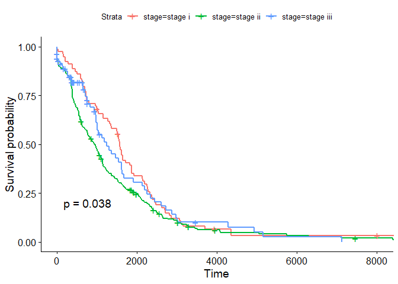
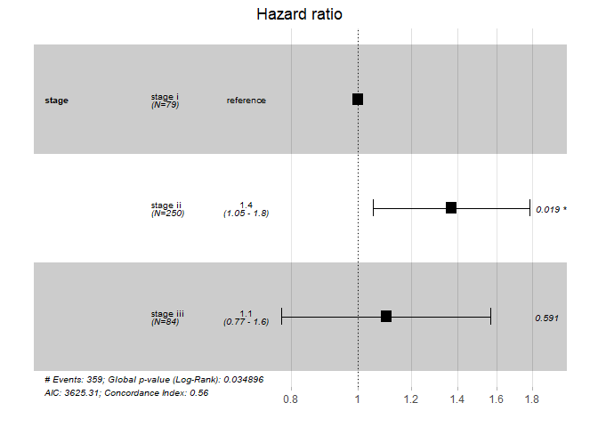
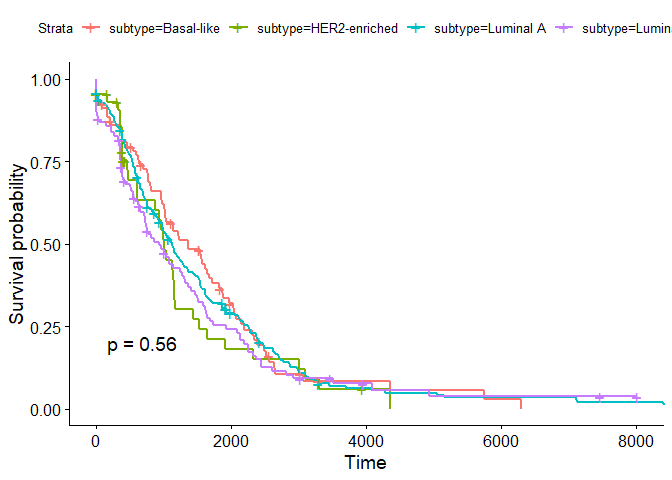
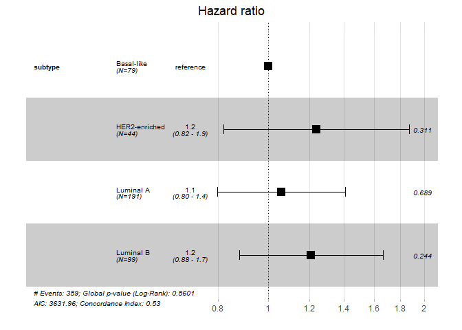

Survival Analysis by Kaplan-Meier rank test and Cox regression
================
Soojung Yang
2019 10 27

The goal of this assessment is to perform survival analysis of clinical
data with respect to two factors, ‘stage’ and ‘subtype’. Survival
analysis is done with 2 different methods - Kaplan-Meier log-rank test
and Cox regression.

#### **DATASET**

**NCBI Build 37 (UCSC hg19)**  
– Citation: Assembly \[Internet\]. Bethesda (MD): National Library of
Medicine (US), National Center for Biotechnology Information; 2012 –
\[cited 2019 09 16\]. Available from:
<https://www.ncbi.nlm.nih.gov/assembly/>

-----

#### **Data Input**

``` r
# BIS335 Data input
clinical<-readRDS("clinical.rds")
expression<-readRDS("expression.rds")
mutation<-readRDS("mutation.rds")

# Common 
# We will remove samples which of subtype is NA (not available).
sample_id_filter<-intersect(colnames(expression),
                            intersect(unique(mutation$sample_id),
                                      clinical$sample_id[which(!is.na(clinical$subtype))]))
clinical_filter<-dplyr::filter(clinical,sample_id %in% sample_id_filter)
clinical_filter <- dplyr::filter(clinical_filter, subtype!='Normal-like')
mutation_filter<-dplyr::filter(mutation, sample_id %in% sample_id_filter)
expression_filter<-expression[,as.character(clinical_filter$sample_id)]
```

## **Problems**

> **1. Describe the purpose of Kaplan-Meier log-rank test and Cox
> regression and their difference. **

A survival curve shows the fraction(or percentage) of patients surviving
over time. Survival curves usually present patient group with same
prognostic factor, same disease, and same specific treatment.

### Kaplan-Meier log-rank test

In the real world, following patient survival time doensn’t usually all
starts at the same time. Also, all patients are diagnosed and treated at
different times. If someone is recorded to live for 3 years, we want to
count the patient as alive for that 3 years, but we don’t want him/her
to be counted as dead nor to be counted as alive after that 3
years.Mathematically removing patient after the follow-up time is called
**Censoring**.

Comparing two survival surves are done by **log-rank test**. This test
tests whether the two surves have significant difference. Test statistic
is a chi-square distribution, and null hypothesis is that there are no
differences among survival curves.

### Cox regression

The difference between Cox regression and Kaplan-Meier log-rank test is
that Cox regression includes explanatory variables for assessment.  
The dependent variable, ‘hazard’, is the probability of dying given the
patient’s survival information for the moment. Hazard function is
obtained by differentiating cumulative Hazard function, which is again
calculated with the formula :  = -lnS(t)") where S(t) is the survival function.

> **2. Perform Kaplan-Meier test and Cox regression using stage and
> subtype data. Interpret those results with survival plot or forest
> plot, and corresponding p-values. **

## (1) Stage - survival analysis

### Kaplan-Meier test

    ## Loading required package: ggplot2

    ## Loading required package: ggpubr

    ## Loading required package: magrittr

``` r
clinical_filter$stage <- factor(clinical_filter$stage)
vital_status <- 1*(clinical_filter$vital_status == 0)
survival_time <- as.numeric(clinical_filter$survival_time)

# 'survival::Surv' creates a censored 'survival object'. 
# default censoring mode is 'right'
su <- survival::Surv(survival_time, vital_status)
str(su)
```

    ##  'Surv' num [1:413, 1:2]    0    0    0    0    0    0    0    0    0    0 ...
    ##  - attr(*, "dimnames")=List of 2
    ##   ..$ : NULL
    ##   ..$ : chr [1:2] "time" "status"
    ##  - attr(*, "type")= chr "right"

``` r
# 'survfit' estimates a survival curve for the censored survival object('su'). 
# the estimates used are 'Kalbfleisch-Prentice' method, which reduces to 'Kaplan-Meier' when the weights are all unity. 
fit.survival <- survfit(su~stage, data = clinical_filter)
fit.survival
```

    ## Call: survfit(formula = su ~ stage, data = clinical_filter)
    ## 
    ##                   n events median 0.95LCL 0.95UCL
    ## stage=stage i    79     73   1572    1351    1871
    ## stage=stage ii  250    232    943     767    1099
    ## stage=stage iii  84     54   1246     975    1683

``` r
# survival curve
ggsurvplot(fit.survival, data=clinical_filter, pval=TRUE)
```

<!-- -->

### Cox regression

``` r
# 'coxph' fits a Cox proportional hazard regression model
fit.cox <- coxph(su~stage, data=clinical_filter)
fit.cox
```

    ## Call:
    ## coxph(formula = su ~ stage, data = clinical_filter)
    ## 
    ##                   coef exp(coef) se(coef)     z      p
    ## stagestage ii  0.31680   1.37273  0.13451 2.355 0.0185
    ## stagestage iii 0.09664   1.10146  0.18000 0.537 0.5914
    ## 
    ## Likelihood ratio test=6.71  on 2 df, p=0.0349
    ## n= 413, number of events= 359

``` r
# 'ggforest' draws Forest Plot for Cox proportional hazards model
ggforest(fit.cox, data=clinical_filter)
```

    ## Warning: Removed 1 rows containing missing values (geom_errorbar).

<!-- -->

### Interpretation

#### p value

p value for Kaplan - Meier test is 0.038, while p value for Cox
regression is 0.035. After taking the explanatory variable ‘stage’ into
account, the p value had decreased. This means that the difference of
the survival time among the stages are more clearly shown. Also, if we
choose our critical value as =0.05, we can reject the null hypothesis
and conclude that there exists significant difference among the stages.

#### Kaplan - Meier test

From the survival curve, we can see that after (0\~3,000 days) the
diagnosis of cancer, stage i patients have the best survival
probability, and stage ii patients have the worst. This is different
from the expectation that stage iii patients would have the worst
survival probability. One possible explanation is that stage iii
patients recieve more intensive and aggressive treatment, which extends
their life. Eventually almost all patients decease after 5,000 days from
diagnosis. This is about 14 years. This cancer might be incurable, or
only elderly people are diagnosed of this cancer.

#### Cox regression

The Forest plot clearly shows the difference among different stages. p
value has changed due to the inclusion of explanatory variable in
analysis. X-axis for this forest plot is hazard ratio. Larger the value,
larger the hazard, and less the survival probability. The box is the
point estimation and the range is 95% confidence interval for the
estimation. The result - harzard ratio - is well matching the result
from Kaplan-Meier test. Hazard ratio is largest in stage ii and smallest
in stage i.

## (2) Subtype - survival analysis

### Kaplan - Meier test

``` r
clinical_filter$subtype <- factor(clinical_filter$subtype)
fit.survival.subtype <- survfit(su~subtype, data = clinical_filter)
fit.survival.subtype
```

    ## Call: survfit(formula = su ~ subtype, data = clinical_filter)
    ## 
    ##                         n events median 0.95LCL 0.95UCL
    ## subtype=Basal-like     79     67   1359    1026    1820
    ## subtype=HER2-enriched  44     34   1007     618    1437
    ## subtype=Luminal A     191    172   1132     974    1363
    ## subtype=Luminal B      99     86    942     709    1321

``` r
ggsurvplot(fit.survival.subtype, data=clinical_filter, pval=TRUE)
```

<!-- -->

### Cox regression

``` r
fit.cox.subtype <- coxph(su~subtype, data=clinical_filter)
fit.cox.subtype
```

    ## Call:
    ## coxph(formula = su ~ subtype, data = clinical_filter)
    ## 
    ##                         coef exp(coef) se(coef)     z     p
    ## subtypeHER2-enriched 0.21384   1.23843  0.21127 1.012 0.311
    ## subtypeLuminal A     0.05795   1.05967  0.14457 0.401 0.689
    ## subtypeLuminal B     0.19010   1.20936  0.16328 1.164 0.244
    ## 
    ## Likelihood ratio test=2.06  on 3 df, p=0.5601
    ## n= 413, number of events= 359

``` r
ggforest(fit.cox.subtype, data=clinical_filter)
```

    ## Warning: Removed 1 rows containing missing values (geom_errorbar).

<!-- -->

### Interpretation

#### p value

p value for Kaplan - Meier test is 0.56, while p value for Cox
regression is 0.56. After taking the explanatory variable ‘subtype’ into
account, the p value was the same. Also, if we choose our critical value
as =0.05, we can accept the null hypothesis and conclude that there
doesn’t exist significant difference among the subtypes.

#### Kaplan - Meier test

Since p value is high, we can’t identify any difference among subtype
groups. Eventually almost all patients decease after 4,000 days from
diagnosis. This cancer might be incurable, or only elderly people are
diagnosed of this cancer.

#### Cox regression

Local p values are also higher than the critical value. Thus, we can’t
find any significant difference.

## References

  - \[1\] Tutorial Manual (BiS335)
  - \[2\] **Statistics review 12: Survival analysis**, Viv Bewick et
    al., Crit Care. 2004; 8(5): 389–394.
  - \[3\] R documentation (<https://www.rdocumentation.org/>)
