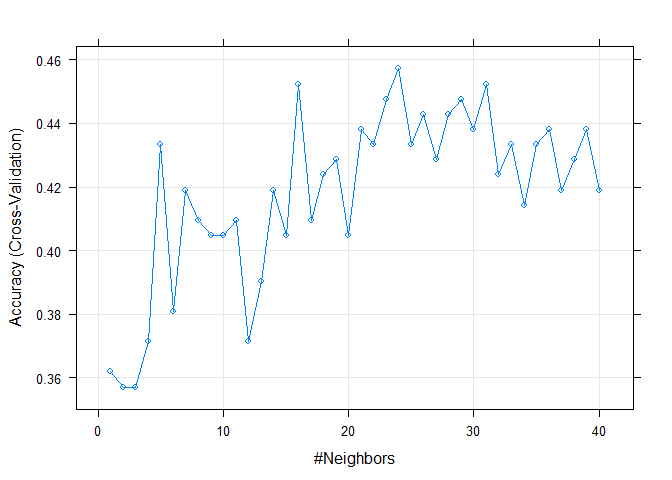

kNN classification by resampling and CV
================
Soojung Yang
2019 11 08

The goal of this assessment is to perform kNN classification by 5-fold
cross validation. kNN algorithm is a famous supervised machine learning
algorithm. This assessment demonstrates balancing the imbalanced data by
undersampling, and selecting appropriate k for kNN classification.

#### **DATASET**

**NCBI Build 37 (UCSC hg19)**  
– Citation: Assembly \[Internet\]. Bethesda (MD): National Library of
Medicine (US), National Center for Biotechnology Information; 2012 –
\[cited 2019 09 16\]. Available from:
<https://www.ncbi.nlm.nih.gov/assembly/>

-----

#### **Data Input**

``` r
# Load data
clin <- readRDS("./data/clinical.rds")
gex <- readRDS("./data/expression.rds")
```

``` r
# Libraries to import 
library(caret)
```

    ## Loading required package: lattice

    ## Loading required package: ggplot2

``` r
library(preprocessCore)
```

We select genes by ANOVA using stage annotation. Also, we reduce
computation time by filtering genes.

**Preprocessing** 1. Quantile Normalization (Between sample
normalization)  
2\. Min - Max Normalization (Feature scaling before calculating
euclidean distance)  
3\. Undersampling (Calibrate class imbalance)

``` r
# Clinical data preprocessing
idx <- intersect(colnames(gex), clin$sample)
clin_p <- clin[clin$sample_id %in% idx, ] 
stage <- as.vector(clin_p$stage)
stage_p <- rep(0,length(stage))
for (i in 1:length(stage)){
if(stage[i]=='stage i'){stage_p[i]=1}
else if(stage[i]=='stage ii'){stage_p[i]=2}
else if(stage[i]=='stage iii'){stage_p[i]=3}
else if(stage[i]=='stage iv'){stage_p[i]=4}
else if(stage[i]=='stage v'){stage_p[i]=5}
}

# Gene expression data preprocessing
gex_p <- gex[, colnames(gex) %in% idx]
gex_p <- na.omit(gex_p) # Remove genes containing NA
temp <- normalize.quantiles(gex_p)
colnames(temp) <- colnames(gex_p)
rownames(temp) <- rownames(gex_p)
gex_p <- temp

# Min - Max normalization (Feature scaling)
normalize <- function(x)
{
return((x- min(x))/(max(x)-min(x)))
}
gex_p <- apply(gex_p, MARGIN=1, normalize)
# Preprocessed data
data <- data.frame(stage_p, gex_p)
```

First, we take ‘test’ dataset from the whole dataset. Taking the test
dataset before the undersampling help us remove the potential bias from
the test set. We will undersample the training set only.

``` r
partition <- createDataPartition(data$stage_p, p=0.8, list=FALSE) # Training:Test=0.8:0.2
test <- data[-partition,]
test$stage_p <- as.factor(test$stage_p)
data <- data[partition,]
```

Now, we balance the class imbalanced data by undersampling.

``` r
# Preprocessing for solving class imbalance 
# Check the number of data for each stage
sum(data$stage_p == 1);sum(data$stage_p == 2);sum(data$stage_p == 3);
```

    ## [1] 70

    ## [1] 238

    ## [1] 89

``` r
# Undersampling for stage 2 and stage 3 
set.seed(123)
stage2.sam <- sample(rownames(data)[data$stage_p == 2], size=min(sum(data$stage_p==1)))
stage3.sam <- sample(rownames(data)[data$stage_p == 3], size=min(sum(data$stage_p==1)))
data_balanced <- data[rownames(data) %in% c(rownames(data)[data$stage_p == 1], stage2.sam, stage3.sam), ]
```

Let’s check the undersampled result.

``` r
sum(data_balanced$stage_p == 1);sum(data_balanced$stage_p == 2);sum(data_balanced$stage_p == 3);
```

    ## [1] 70

    ## [1] 70

    ## [1] 70

The number of each data is all the same.

## 5-fold CV, varying k of kNN

## 1.balanced data

Number of data in Train set from balanced dataset is 231.

``` r
# ANOVA with balanced data
# Gene selection for decreasing computation time using ANOVA
feature.size <- 2
aov.gene.pval <- c()
for(i in 2:(ncol(data_balanced))){
aov.gene.pval <- c(aov.gene.pval, summary(aov(data_balanced$stage_p ~ data_balanced[, i]))[[1]][["Pr(>F)"]][1])
}
aov.idx <- order(aov.gene.pval, decreasing=FALSE)[1:feature.size] # (ANOVA P value top n genes)
data_balanced.aov <- data_balanced[, c(1, 1+aov.idx)] # 1st column is stage_p
```

``` r
data_balanced.aov$stage_p <- as.factor(data_balanced.aov$stage_p) # stage_p numeric to factor for classification
train_balanced <- data_balanced.aov
k <- expand.grid(k = c(1:40))
```

``` r
# k-fold Cross Validation
set.seed(123)
ctrl <- trainControl(method="cv", number=5)
knn.cv <- train(stage_p~., train_balanced, method="knn", trControl=ctrl,
preProcess=c("center", "scale"), tuneGrid=k)
knn.cv$results
```

    ##     k  Accuracy      Kappa AccuracySD    KappaSD
    ## 1   1 0.3619048 0.04285714 0.04579853 0.06869780
    ## 2   2 0.3571429 0.03571429 0.05583828 0.08375742
    ## 3   3 0.3571429 0.03571429 0.09221389 0.13832083
    ## 4   4 0.3714286 0.05714286 0.07063046 0.10594569
    ## 5   5 0.4333333 0.15000000 0.07221786 0.10832679
    ## 6   6 0.3809524 0.07142857 0.06070261 0.09105392
    ## 7   7 0.4190476 0.12857143 0.10459944 0.15689916
    ## 8   8 0.4095238 0.11428571 0.07221786 0.10832679
    ## 9   9 0.4047619 0.10714286 0.08417938 0.12626907
    ## 10 10 0.4047619 0.10714286 0.08584646 0.12876969
    ## 11 11 0.4095238 0.11428571 0.07968191 0.11952286
    ## 12 12 0.3714286 0.05714286 0.02714703 0.04072055
    ## 13 13 0.3904762 0.08571429 0.03610893 0.05416340
    ## 14 14 0.4190476 0.12857143 0.08178840 0.12268260
    ## 15 15 0.4047619 0.10714286 0.03764616 0.05646924
    ## 16 16 0.4523810 0.17857143 0.05832118 0.08748178
    ## 17 17 0.4095238 0.11428571 0.03104382 0.04656573
    ## 18 18 0.4238095 0.13571429 0.02608203 0.03912304
    ## 19 19 0.4285714 0.14285714 0.02916059 0.04374089
    ## 20 20 0.4047619 0.10714286 0.04123930 0.06185896
    ## 21 21 0.4380952 0.15714286 0.05734093 0.08601139
    ## 22 22 0.4333333 0.15000000 0.06162942 0.09244414
    ## 23 23 0.4476190 0.17142857 0.04579853 0.06869780
    ## 24 24 0.4571429 0.18571429 0.07968191 0.11952286
    ## 25 25 0.4333333 0.15000000 0.06606875 0.09910312
    ## 26 26 0.4428571 0.16428571 0.06859457 0.10289186
    ## 27 27 0.4285714 0.14285714 0.03764616 0.05646924
    ## 28 28 0.4428571 0.16428571 0.04325215 0.06487822
    ## 29 29 0.4476190 0.17142857 0.03104382 0.04656573
    ## 30 30 0.4380952 0.15714286 0.03984095 0.05976143
    ## 31 31 0.4523810 0.17857143 0.03764616 0.05646924
    ## 32 32 0.4238095 0.13571429 0.01992048 0.02988072
    ## 33 33 0.4333333 0.15000000 0.04259177 0.06388766
    ## 34 34 0.4142857 0.12142857 0.03194383 0.04791574
    ## 35 35 0.4333333 0.15000000 0.02608203 0.03912304
    ## 36 36 0.4380952 0.15714286 0.03984095 0.05976143
    ## 37 37 0.4190476 0.12857143 0.03984095 0.05976143
    ## 38 38 0.4285714 0.14285714 0.01683588 0.02525381
    ## 39 39 0.4380952 0.15714286 0.03194383 0.04791574
    ## 40 40 0.4190476 0.12857143 0.03194383 0.04791574

``` r
plot(knn.cv)
```

<!-- -->

k = 32 shows the best accuracy: 0.442  
k = 32 is used for computing the test metics.

``` r
knnPred.cv <- predict(knn.cv, newdata=test)
confusionMatrix(knnPred.cv, test$stage_p)
```

    ## Confusion Matrix and Statistics
    ## 
    ##           Reference
    ## Prediction  1  2  3
    ##          1  9 14  8
    ##          2  3 14  2
    ##          3  7 30 12
    ## 
    ## Overall Statistics
    ##                                          
    ##                Accuracy : 0.3535         
    ##                  95% CI : (0.2601, 0.456)
    ##     No Information Rate : 0.5859         
    ##     P-Value [Acc > NIR] : 1              
    ##                                          
    ##                   Kappa : 0.099          
    ##                                          
    ##  Mcnemar's Test P-Value : 6.1e-07        
    ## 
    ## Statistics by Class:
    ## 
    ##                      Class: 1 Class: 2 Class: 3
    ## Sensitivity           0.47368   0.2414   0.5455
    ## Specificity           0.72500   0.8780   0.5195
    ## Pos Pred Value        0.29032   0.7368   0.2449
    ## Neg Pred Value        0.85294   0.4500   0.8000
    ## Prevalence            0.19192   0.5859   0.2222
    ## Detection Rate        0.09091   0.1414   0.1212
    ## Detection Prevalence  0.31313   0.1919   0.4949
    ## Balanced Accuracy     0.59934   0.5597   0.5325

Test accuracy for model trained with balanced dataset is 0.34.

``` r
knn.cv.acc <- mean(knnPred.cv == test$stage_p)
knn.cv.acc
```

    ## [1] 0.3535354

## 2\. imbalanced (original) data

Number of data in Train set from the original dataset is 397.

``` r
# ANOVA with original data
# Gene selection for decreasing computation time using ANOVA
feature.size <- 2
aov.gene.pval <- c()
for(i in 2:(ncol(data))){
aov.gene.pval <- c(aov.gene.pval, summary(aov(data$stage_p ~ data[, i]))[[1]][["Pr(>F)"]][1])
}
aov.idx <- order(aov.gene.pval, decreasing=FALSE)[1:feature.size] # (ANOVA P value top n genes)
data.aov <- data[, c(1, 1+aov.idx)] # 1st column is stage_p
```

``` r
data.aov$stage_p <- as.factor(data.aov$stage_p) # stage_p numeric to factor for classification
partition <- createDataPartition(data.aov$stage_p, p=0.8, list=FALSE) # Training:Test=0.8:0.2
train <- data.aov
```

``` r
k <- expand.grid(k = c(1:40))

# k-fold Cross Validation
set.seed(123)
ctrl <- trainControl(method="cv", number=5)
knn.cv <- train(stage_p~., train, method="knn", trControl=ctrl,
preProcess=c("center", "scale"), tuneGrid=k)
knn.cv$results
```

    ##     k  Accuracy        Kappa AccuracySD    KappaSD
    ## 1   1 0.4558845  0.022474562 0.03623546 0.06305338
    ## 2   2 0.4407879  0.010172525 0.03122691 0.02816785
    ## 3   3 0.4585443 -0.022067124 0.03207170 0.04621202
    ## 4   4 0.4686401 -0.025341870 0.04945102 0.05884767
    ## 5   5 0.5037042 -0.006312666 0.05441068 0.09913045
    ## 6   6 0.5288632 -0.007331819 0.05597781 0.09670724
    ## 7   7 0.5362033  0.001983155 0.06145126 0.10541688
    ## 8   8 0.5464914  0.016654818 0.05712559 0.11009087
    ## 9   9 0.5590555  0.036928762 0.05543767 0.10840840
    ## 10 10 0.5641512  0.046744029 0.05733676 0.10182609
    ## 11 11 0.5489914  0.003043504 0.04877511 0.09449942
    ## 12 12 0.5439589 -0.021599550 0.03868034 0.07174124
    ## 13 13 0.5540547 -0.012447358 0.04053054 0.08011401
    ## 14 14 0.5617470 -0.009416274 0.04783368 0.07943457
    ## 15 15 0.5642470 -0.008636659 0.04397036 0.07668479
    ## 16 16 0.5641821 -0.014245814 0.03443646 0.06495314
    ## 17 17 0.5794385  0.005601088 0.04029486 0.07437951
    ## 18 18 0.5819385  0.002723039 0.04314580 0.07998731
    ## 19 19 0.5844701  0.003568521 0.03550783 0.06147444
    ## 20 20 0.5844377 -0.003683032 0.02696792 0.05292162
    ## 21 21 0.5819377 -0.005127724 0.02859203 0.05623232
    ## 22 22 0.5970018  0.024169426 0.03403638 0.07364116
    ## 23 23 0.5944377  0.015817146 0.03148534 0.06329126
    ## 24 24 0.5970334  0.015121444 0.03103947 0.06755146
    ## 25 25 0.5970334  0.015121444 0.03103947 0.06755146
    ## 26 26 0.5970334  0.015121444 0.03103947 0.06755146
    ## 27 27 0.5945334  0.006680288 0.02576155 0.05376435
    ## 28 28 0.5920334  0.002907704 0.02718210 0.05662903
    ## 29 29 0.5970334  0.010594343 0.02700136 0.05590997
    ## 30 30 0.5970334  0.010594343 0.02700136 0.05590997
    ## 31 31 0.5944693  0.001984459 0.02370924 0.04299267
    ## 32 32 0.5919693 -0.001929597 0.02192456 0.03909989
    ## 33 33 0.5969693  0.005845463 0.02344823 0.04144164
    ## 34 34 0.5969693  0.005845463 0.02344823 0.04144164
    ## 35 35 0.5995010  0.014140733 0.01812885 0.02739840
    ## 36 36 0.5969693  0.005845463 0.02344823 0.04144164
    ## 37 37 0.5970010  0.006037140 0.01888878 0.03666653
    ## 38 38 0.5969693  0.005845463 0.02344823 0.04144164
    ## 39 39 0.5995010  0.009583786 0.01812885 0.03459141
    ## 40 40 0.5919369 -0.006241266 0.01861238 0.03290101

``` r
plot(knn.cv)
```

<!-- -->

``` r
knnPred.cv <- predict(knn.cv, newdata=test)
confusionMatrix(knnPred.cv, test$stage_p)
```

    ## Confusion Matrix and Statistics
    ## 
    ##           Reference
    ## Prediction  1  2  3
    ##          1  0  0  0
    ##          2 19 56 22
    ##          3  0  2  0
    ## 
    ## Overall Statistics
    ##                                          
    ##                Accuracy : 0.5657         
    ##                  95% CI : (0.4623, 0.665)
    ##     No Information Rate : 0.5859         
    ##     P-Value [Acc > NIR] : 0.6964         
    ##                                          
    ##                   Kappa : -0.0305        
    ##                                          
    ##  Mcnemar's Test P-Value : NA             
    ## 
    ## Statistics by Class:
    ## 
    ##                      Class: 1 Class: 2 Class: 3
    ## Sensitivity            0.0000   0.9655   0.0000
    ## Specificity            1.0000   0.0000   0.9740
    ## Pos Pred Value            NaN   0.5773   0.0000
    ## Neg Pred Value         0.8081   0.0000   0.7732
    ## Prevalence             0.1919   0.5859   0.2222
    ## Detection Rate         0.0000   0.5657   0.0000
    ## Detection Prevalence   0.0000   0.9798   0.0202
    ## Balanced Accuracy      0.5000   0.4828   0.4870

Test accuracy for model trained with balanced dataset is 0.65.

``` r
knn.cv.acc <- mean(knnPred.cv == test$stage_p)
knn.cv.acc
```

    ## [1] 0.5656566

## **Problems**

> **1. Plot estimated accuracy with 5-fold CV, varying k of knn model
> and find optimal k. **

We can say that k=31 is the optimal value of number of neighbors. The
optimal k for classification task is an odd number for tie-breaking,
since we are finding the most frequent class.

If k is too small, the result would be unstable, because there might be
a case where few points of different class happen to be nearest to the
query point.

On the other hand, if k is too large, the area we are looking at for a
query point would be too large, and the error will increase. Thus, there
might be an optimal point for k, where the accuracy is maximized.

The maximum accuracy point which is an odd number is the optimal value
of k.

> **2. Repeat 5-fold CV after removing class imbalance calibration step.
> Then, find the tendency of accuracy according to k value. Discuss its
> reason in terms of kNN algorithm. **

Accuracy has dropped due to the undersampling of the dataset. Before
balancing the data, the accuracy was 0.65. After balancing, the accuracy
has dropped to 0.34.

#### **Comparing balanced and imbalanced datasets**

For given query point, kNN algorithm iterates through sample points and
pick k nearest neighbors of the query point. Then, if it’s a regression
task, we take the mean of those k nearest neighbors as the estimate for
the query value. It it’s a classification task, we take the mode as the
estimate.

If the data are imbalanced, a class of few samples would be
under-represented. In the k nearest set of a query point, we decide the
class of the query point by counting the number of points of each class
and finding the most frequent class. If the number of samples of a class
is significantly few compared to others, it can never be chosen as the
most frequent class. Thus, balancing the data is very crucial for kNN
algorithm.

However, in this assessment, imbalanced data showed better accuracy.
There can be two reasons for this. First, For classification tasks,
AUC-ROC value or F1 metric would be better metric than accuracy. Because
the test datset is imbalanced, imbalanced data might show better
performance in mere accuracy metric. If we calculate AUC-ROC or F1
value, then the balanced data would show better performance. Secondly,
since we balanced the data by undersampling, we have lost 77 samples.
Original dataset itself had very little samples (397), so losing such a
large quantity of samples has might affected the quality of kNN
classification.

#### **Tendency of accuracy according to k value**

For imbalanced data, k - accuracy plot keeps increasing, and reaches
plateau to certain accuracy value (0.65). As I explained in question 1,
if k is too small, the result would be unstable, because there might be
a case where few points of different class happen to be nearest to the
query point. So increased accuracy for increased k is natural. The
reason why accuracy doesn’t decrease with large k, but keep maintaining
the plateau might be that the sample points are well grouped by their
class, and the features selected by ANOVA are sufficient for the
classification.

## References

  - \[1\] Tutorial Manual (KAIST BiS335)
